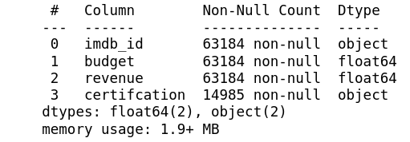
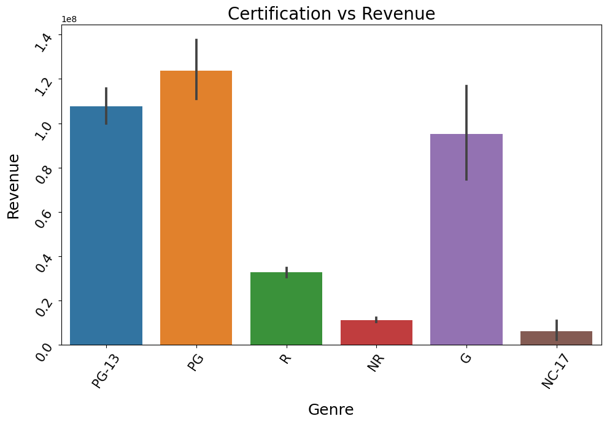
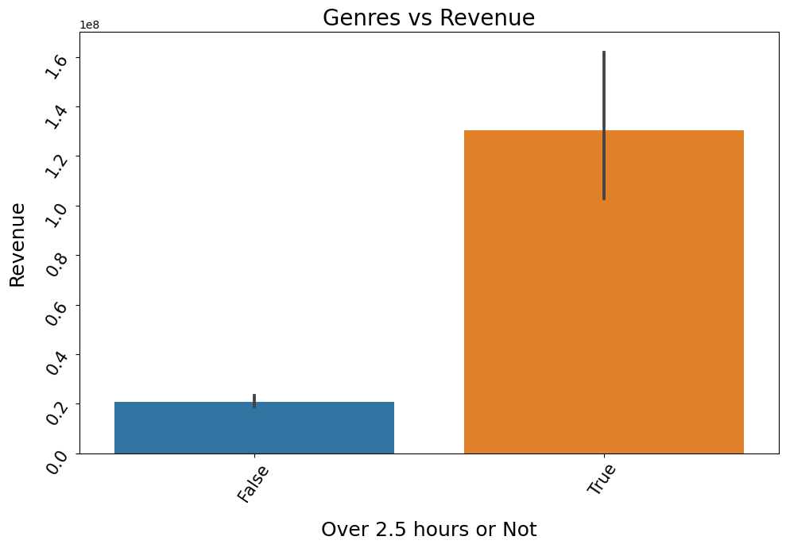
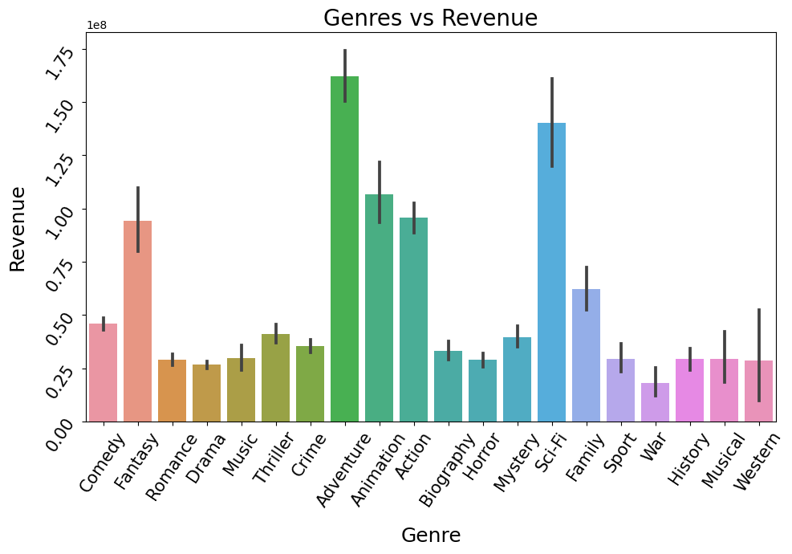

# Movies Analysis

## A series of hypothesis test done on what makes a movie successful 

### Rose Tovar
### RoseATovar@gmail.com

### Objective
This project took data of from different sources on movies in the united states between the years 2000 and 2022. Finicial data was pulled from The Movie Database while title information and ratings was pulled from imdb datasets. This data was cleaned and turned into a MySQL database which was used for the three hypothesis test that were conducted to help determine what makes a succesful movie.  

### The Data
- https://datasets.imdbws.com/
- https://www.themoviedb.org/

These two sources were used to get all the data used in this project. 

### Database Tables
#### Genres

#### Title Genres

#### Title Basics

#### Title Ratings

#### TMDB Data

### Hypothesis Testing Insights

#### Ratings Vs. Revenue

> This plot goes along with what we found in our hypothesis test, that revenue is effected by the films certification. Films that rate around G, PG, PG-13 perform much better than the other films when it comes to revenue. This is most likely because that families go the movies together and watch lower rated films. 

#### If movies make more revenue when they are longer than 2.5 hours or not

> This plot also goes along with our hypothesis testing, that films that are over 150 minutes tend to have higher revenue. There are other factors that probably go into this like the budget, And this leads us to going into other hypothesis testing as next steps. 

#### Genre Vs. Revenue

> This plot shows us that that the popular genres are Fantasy, Adventure, Animation, Action, and Scifi. These films make a lot more in revenue compared to the others. This shows us that our alternative hypothesis was more in line because we can visually see that certain genres make more in revenue compared to others

### Conclusion
Our hypothesis testing gave us many insights on what can influence the revenue that a film may give us. Certain genres, length, and Ratings all go into play when determining how much revenue a film will earn. 

### Next Steps
Conducting a more advanced Linear Regression to determine what factors best play into determining how much revenue a film may generate. 