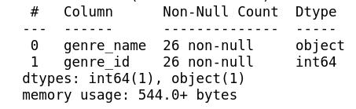
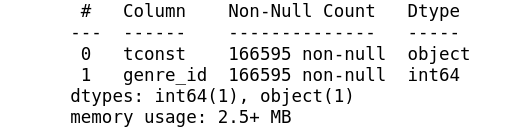

# Movies Analysis

## A series of hypothesis test done on what makes a movie successful 

### Rose Tovar
### RoseATovar@gmail.com

### Objective
This project took data of from different sources on movies in the united states between the years 2000 and 2022. Finicial data was pulled from The Movie Database while title information and ratings was pulled from imdb datasets. This data was cleaned and turned into a MySQL database which was used for the three hypothesis test that were conducted to help determine what makes a succesful movie.  

### The Data
- https://datasets.imdbws.com/
- https://www.themoviedb.org/

These two sources were used to get all the data used in this project. 

### Database Tables
#### Genres

#### Title Genres

#### Title Basics

#### Title Ratings

#### TMDB Data

